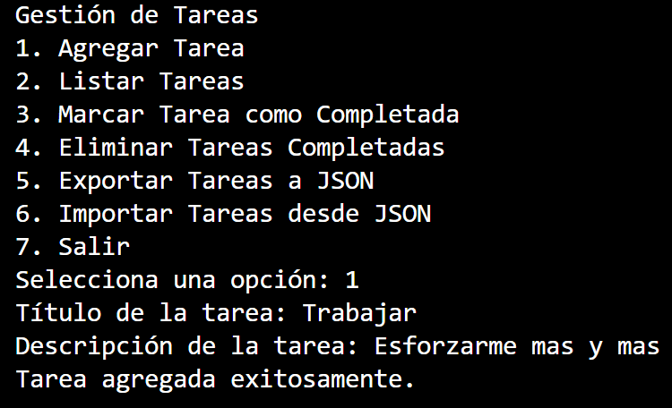
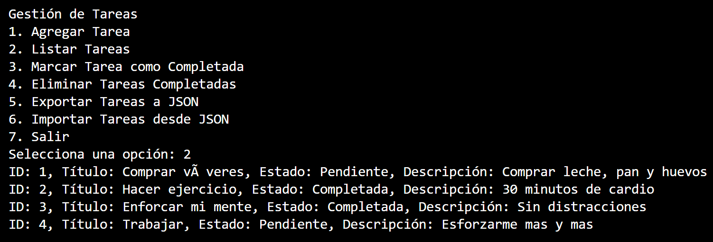
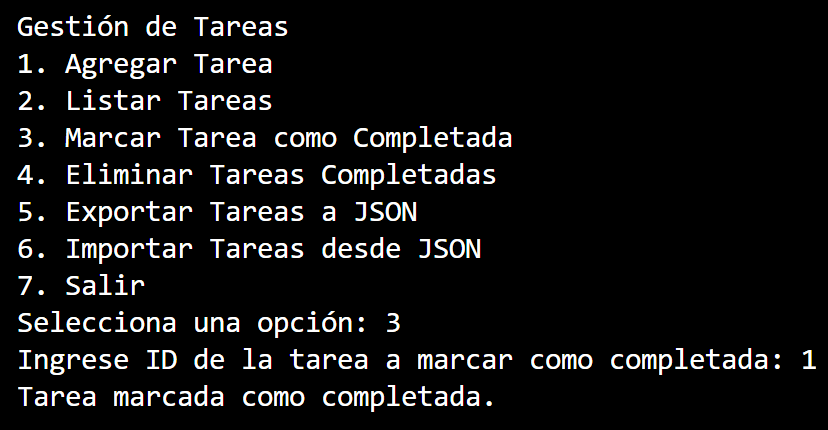
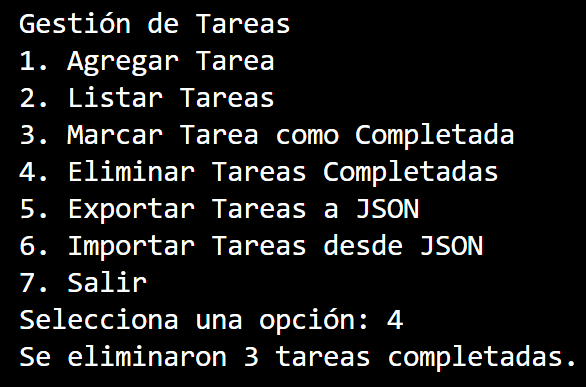
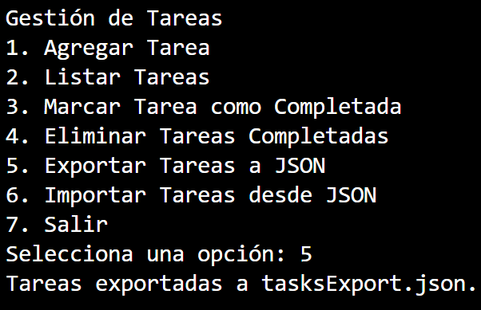
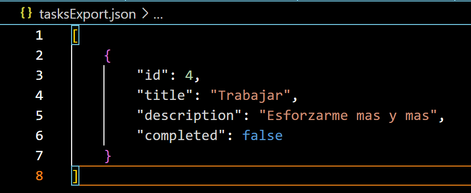
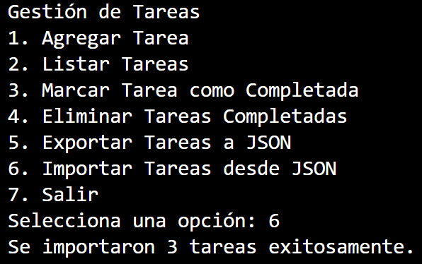
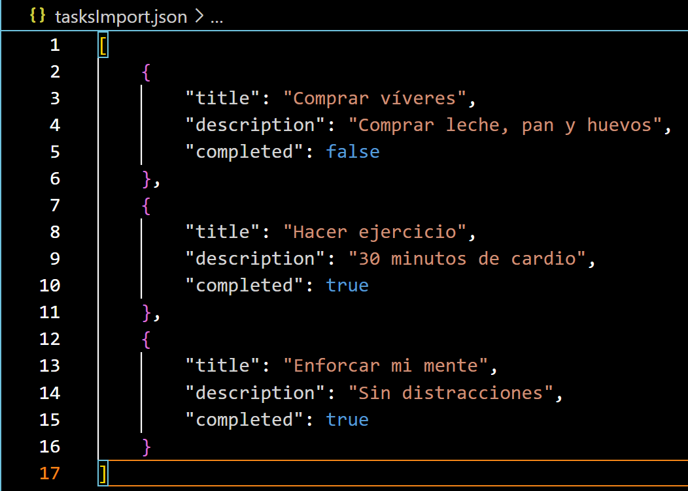
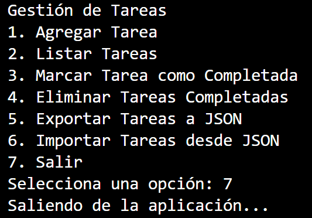

# Desarrollador Junior Jose Samuel Alvarez Silva 
# Proyecto Semana 1 , Curso de Inteligencia Artificial 
# Entrega dia 16 de Diciembre del 2024

# Implementacion 
## Para ejecutar el siguiente script que su principal logica es agregar tareas de usuarios con un nombre y decripcion asignando un valor de pendientes o completadas , necesitamos utilizar una version de python actualizada , necesitamos la libreria sqlalchemy para interactuar con la base de datos SQLite para la persistencia. 

# Funcionalidades del Menú
### La aplicación tiene un menú interactivo que permite al usuario realizar diversas operaciones de gestión de tareas.

## 1. Agregar Tarea
### Descripción: Permite agregar una nueva tarea con un título y una descripción , al generar una tarea automaticamente se le asigna un ID unico autoincremental configurado en el script , y a su vez se asigna una tarea nueva como pendiente para posteriormente poder asignarse como completada.
### Validación: No se permite agregar tareas sin título ni descripción.
### Flujo: 
### - El usuario ingresa un título y descripción , dichos campos no pueden ser vacios ya que hay una validador que no lo permite.
### - La tarea se guarda en la base de datos de SQLite usando sqlalchemy con el fin de visualizar mejor la persistencia del script.

## 2. Listar Tareas
### Descripción: Muestra todas las tareas existentes en la base de datos.
### Validación: Si no hay tareas registradas, muestra un mensaje indicando que la lista está vacía.

## 3. Marcar Tarea como Completada
### Descripción: Permite marcar una tarea como completada.
### Validaciones:
### - Verifica si el ID ingresado existe.
### - Si la tarea ya está marcada como completada, muestra un mensaje.
### - Maneja errores si el usuario ingresa un valor no numérico.

## 4. Eliminar Tareas Completadas
### Descripción: Elimina todas las tareas que están marcadas como completadas.
### Flujo:
### - Si existen tareas completadas, se eliminan de la base de datos.
### - Si no hay tareas completadas, muestra un mensaje.

## 5. Exportar Tareas a JSON
### Descripción: Exporta todas las tareas de la base de datos a un archivo JSON llamado tasksExport.json.
### Flujo:
### - El archivo incluirá las tareas con sus campos id, title, description y completed.
### - Muestra un mensaje de confirmación al usuario.
### - Si no encuentra tareas para exportar mostrara un mensaje.

## 6. Importar Tareas desde JSON
### Descripción: Importa tareas desde un archivo JSON existente.
### Flujo:
### - El programa lee un archivo tasksImport.json en el mismo directorio.
### - Importa cada tarea al sistema, siempre y cuando el archivo tenga el formato correcto.
### - Maneja errores de lectura o formato inválido.

## 7. Salir
### Descripción: Finaliza la ejecución del programa.

### El menu en sus campos si no encuentra opciones disponibles o coincidentes preguntara por una opcion valida
